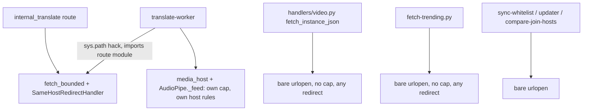
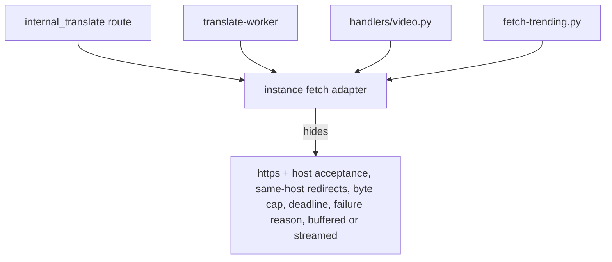

# Architecture review — 2026-10-04

## Scope

No direction was given. Commit messages in this repo are mostly `.`, so the hot spots were read from the plan sequence instead: the last six builds (48 instance captions, 49 Whisper worker, 50 generation in page, 45 worker/whitelist lock, and their harvests) were all **Translate**, before that Trending (45–47) and ANN ids (41–44). Today's session also hit two live failures in this area (an object-storage host with an incomplete cert chain, and a moov-at-end MP4 decoding to nothing), both inside the media fetch.

Scanned: `engine/server/data/subtitles.py`, `engine/server/api/handlers/internal_translate.py`, `engine/server/db/jobs/translate-worker.py`, `engine/server/api/handlers/similar.py` (routing only), `engine/server/api/server.py`, `client/backend/lib/engine_api_client.py`, `client/backend/server.py`, `client/frontend/src/data/translate.ts`, `client/frontend/src/pages/video-page/translate.ts` (grep hits only), and their tests. For the first candidate, the other source-instance fetchers were also checked: `handlers/video.py`, `db/jobs/fetch-trending.py`, `sync-whitelist.py`, `updater-worker.py`, `compare-join-hosts.py`.

## Candidate: one source-instance fetch adapter

**Strength**: `Strong`

**Files**: `engine/server/api/handlers/internal_translate.py:48-104` (`same_host_https`, `SameHostRedirectHandler`, `fetch_bounded`); `engine/server/db/jobs/translate-worker.py:36-48, 158-170, 230-256` (path hack and import from a route module, `media_host`, `AudioPipe._feed`); `engine/server/api/handlers/video.py:82-101` (`fetch_instance_json`); `engine/server/db/jobs/fetch-trending.py:73-88`; `sync-whitelist.py:225-230`, `updater-worker.py:530-535`, `compare-join-hosts.py:57-59` (not read beyond the `urlopen` line).

**Problem**: "Fetch something from a PeerTube instance (or the host its JSON names), https only, redirects kept on that host, bytes capped, time bounded, failure explained" is a rule the codebase needs in many places and implements once properly, once as a copy, and several times not at all:
- The translate route and the worker each implement host acceptance and the byte cap; the worker's `media_host` adds a TLD rule the route lacks; both copy the same exception tuple. The worker has no wall-clock deadline for media; the route does.
- The worker reaches the shared half by putting `api/` on `sys.path` and importing from a **route handler** (`translate-worker.py:48`), a dependency in the wrong direction.
- `fetch_bounded` returns `None` with no reason, so the worker writes a generic `video JSON fetch failed` (`translate-worker.py:453`); today's cert failure was only diagnosable because the media path happens to carry the exception text.
- `handlers/video.py:87` (on every `/api/video` request) and `fetch-trending.py:79` use bare `urlopen` with `resp.read()`: no byte cap, and urllib's default redirect handler follows redirects to any host and scheme. These are untrusted remote hosts. (Observation only; not tested.)
- Tests pay for the split: `test_translate_worker.py` patches `build_opener` in two module namespaces (`:507-508`) and re-implements the scripted host from `test_internal_translate.py:238-269`.

**Deletion test**: Deleting `fetch_bounded`/`SameHostRedirectHandler` would push URL, redirect and cap rules into every caller, so the logic earns its place. What is wrong is where it lives and that only half of it is shared: complexity is concentrated for one caller and duplicated or missing for the rest.

**Solution**: Move the instance-fetch rules out of the route into one adapter module under `engine/server/` that both the Engine and the jobs import. It would own URL acceptance, the same-host redirect policy, the byte cap, deadlines and a failure reason, in a buffered form (JSON, caption tracks) and a streamed form (media into ffmpeg). Callers state what they want (host, path or URL, caps) and get bytes or a stream, or a reason. Migrating `video.py` and `fetch-trending.py` onto it is where the leverage is; doing so is a behaviour change (they gain caps and lose cross-host redirects) and needs its own decision.

**Benefits**: Locality: every rule about talking to a remote instance sits in one file, so a bug like today's shows up there. Leverage: at least five callers inherit caps, redirect policy and reasons. Testability: one seam to replace in tests instead of `build_opener` in two namespaces, and the policy itself (host acceptance, redirect refusal, cap, deadline) becomes testable once, at its own interface.

**Before**

**After**

## Candidate: translate job handle in the subtitles store

**Strength**: `Strong`

**Files**: `engine/server/data/subtitles.py:44, 105, 123-193`; `engine/server/db/jobs/translate-worker.py:410-496, 521, 555-572`; `engine/server/api/handlers/internal_translate.py:215-240, 287-332`; `engine/server/api/server.py:371-372`.

**Problem**: A translate job's lifecycle runs through four modules, and the store's interface hands its invariants to callers:
- After claim, the worker builds `(video_id, instance_domain, TARGET_LANGUAGE, started_at)` by hand (`translate-worker.py:473`) and passes `*claim` into every finish/requeue call (8 call sites) so `_update_claim` can compare-and-set on `started_at`.
- `store_ready_subtitles` documents "against a job row it ends the job … so read state first" (`subtitles.py:105`); the route obeys, the worker does an unconditional upsert followed by a conditional `mark_translate_finished` (`translate-worker.py:445-446`).
- `recover_translate_jobs` is only safe under the worker's flock, which only `command_run`'s ordering ensures; every opener must call `ensure_subtitles_schema` after `connect_subtitles_db` and create the directory first; the route repeats the `subtitles_db_lock` / `None` check three times.
- `JobTakenOver` names a route takeover of a running row, but the current route never fetches over a running row; the explorer found no current writer that triggers it (not verified against an older blue/green Engine).
- Tests fake `server` as a `SimpleNamespace` with three lock/connection attributes (`test_internal_translate.py:510-512`).

**Deletion test**: The finish/requeue functions are one-line wrappers over `_update_claim`; deleting them would just move SQL fragments into the worker, so they are shallow. The real complexity (CAS on `started_at`, recovery, the ready-instance-while-running case) has no single owner, so it is spread, not concentrated.

**Solution**: Make claiming return a job handle that carries its own key and `started_at` and exposes the end states (ready with cues, already English, failed with text, requeue, running cues), with the CAS inside. Opening the store would migrate it, so "schema before use" stops being a caller's job. The "instance track found while running" case becomes one store operation, not two calls the worker must order.

**Benefits**: Locality: the job state machine lives in one module. Testability: the lifecycle (including takeover and recovery) is testable at the store's interface without the worker's media pipeline. Leverage is moderate: two callers today (worker, route).

## Candidate: one declared translate state contract

**Strength**: `Worth exploring`

**Files**: `client/backend/lib/engine_api_client.py:17-23, 156-208`; `client/frontend/src/data/translate.ts:11-20, 101, 110-123`; `client/frontend/src/pages/video-page/translate.ts:175, 181`; `engine/server/api/handlers/internal_translate.py:33-40, 183, 290-308`; `engine/server/db/jobs/translate-worker.py:60-61, 424`.

**Problem**: The Translate state contract (states, the `available` default, cue shape, `after`/`total`, "video not found" means `none`) is re-derived in the Engine, the Client gateway and the frontend. Cue sorting is written four times. `VIDEO_NOT_FOUND` is matched by string across processes. The page's requeue detection (`state.total < runningHeld`) depends on Engine slicing behaviour nothing documents. `HEARTBEAT_SECONDS` (worker) and `HEARTBEAT_FRESH_MS` (route), and the timeout chain from the Client's 20 s to the deploy's 30 s drain, are coupled only by comments.

**Deletion test**: Deleting the Client gateway's validation would move it, not concentrate it, and at a trust boundary re-validation is deliberate. The friction is not the layers but that no one place declares what they validate against.

**Solution**: Declare the contract once (a schema or a small shared constants file the tests check every layer against), and put the heartbeat pair in one constant both Engine and worker import. Keep each layer's validation.

**Benefits**: A change to the state set or cue shape fails a test in every layer at once instead of drifting. Low leverage beyond Translate.

## Candidate: split translate-worker.py along its deep parts

**Strength**: `Worth exploring`

**Files**: `engine/server/db/jobs/translate-worker.py` (enqueue CLI `:100-155, 588-620`; media choice `:158-198`; `AudioPipe` `:201-308`; `WhisperRunner` `:311-361`; chunking `:364-381`; job pipeline `:384-496`; heartbeat and service loop `:499-585`); `tests/active/test_translate_worker.py:207-216, 252-253, 1029-1032, 1056-1057, 1177`.

**Problem**: The file is several deep modules sharing one file. `AudioPipe` and `WhisperRunner` each hide a lot behind a narrow interface; `generate` (`:430-468`) mixes whitelist I/O, the instance-track shortcut, JSON validation and pipe orchestration. Timing is tuned through module globals, so tests load the hyphenated script via `spec_from_file_location`, monkeypatch constants, and need a `-c` driver subprocess to lower `STALL_SECONDS`.

**Deletion test**: Deleting `AudioPipe` or `WhisperRunner` would scatter threads, caps and CUDA setup into the pipeline, so they concentrate complexity and should stay. The file boundary itself hides nothing: splitting it moves code without changing depth.

**Solution**: Mostly follows from the first two candidates: media acquisition joins the fetch adapter, job state moves behind the job handle, and what remains is the pipeline plus the service loop. Passing the timing values as parameters to `serve` would remove the `-c` driver. Cost in locality: the R1/R2/R5 rationale comments now sit beside the code they justify and would have to move with it.

**Benefits**: Mainly testability of the service loop; low leverage on its own.

## Candidate: one "resolve translatable video" function

**Strength**: `Speculative`

**Files**: `engine/server/api/handlers/internal_translate.py:246-274` (`_resolve_translate_key`); `engine/server/db/jobs/translate-worker.py:100-123` (`resolve_video`); `engine/server/api/handlers/video.py:281`.

**Problem**: Whitelist row lookup plus active-denylist check is written twice. The route version writes 400/404 itself, which is why the worker could not reuse it. The two read the error threshold from different places, and the worker carries the pitfall "fetch_video_row with a None host matches any host" in a comment.

**Deletion test**: Neither copy can go without the other absorbing it; a shared function that takes a connection and returns a row or a refusal would concentrate it.

**Solution**: One function returning row-or-refusal; the HTTP mapping stays in the route. Small; best done as part of the job-handle candidate.

**Benefits**: Removes one drift point between the page's enqueue and the worker's claim.

## Candidate: routing out of handlers/similar.py

**Strength**: `Speculative`

**Files**: `engine/server/api/handlers/similar.py:13-14, 102, 413-478`; `engine/server/api/server.py:123, 469`.

**Problem**: `SimilarHandler` is the Engine's only handler class, so routing and bridge auth for every `/internal/*` route live in a 1275-line file named for similarity; the translate builds edited it only to add routes. This is a locality cost, not a depth one.

**Deletion test**: Not applicable as a deepening; moving the dispatch table out would move code without hiding anything new.

**Solution**: A separate router module. Low value until routes keep being added.

**Benefits**: New routes stop touching the similarity file. Little else.

## Top recommendation

Start with **one source-instance fetch adapter**. It has the most leverage (two real adapters already exist, which by this skill's rule makes it a real seam, and at least three more callers fetch from untrusted instances with no byte cap and unrestricted redirects), it is where today's two production failures surfaced, and it removes the worker's import from a route module. The translate job handle is a close second and smaller in reach; the worker split mostly falls out of doing these two.
