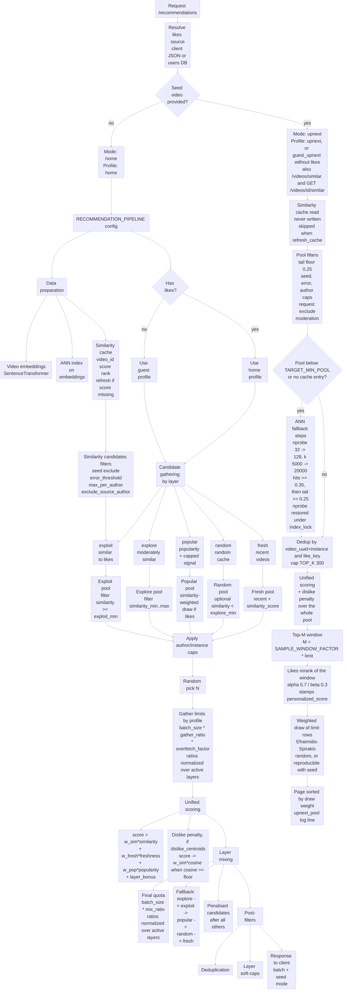

# Recommendation Delivery Pipeline Diagram

Below is a Mermaid diagram of the delivery pipeline, based on `engine/server/api/recommendations/docs/OVERVIEW.md`. The home feed runs the layer pipeline. Up-next, a seeded request, builds one similarity pool and draws its page from that pool. For the up-next parameters see `LAYER_PARAMS.md`.

